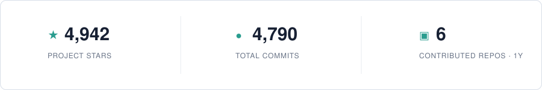

## Hi, I'm Yuyang Hu 👋

I am a second-year PhD student at the [Gaoling School of Artificial Intelligence](http://ai.ruc.edu.cn/), [Renmin University of China](https://www.ruc.edu.cn/), advised by [Prof. Zhicheng Dou](http://playbigdata.ruc.edu.cn/dou/). My research focuses on **long-horizon agents, agent memory, and autonomous research**.

I am currently a research intern at the **LLM Center, Shanghai Artificial Intelligence Laboratory**, working with [Prof. Tao Gui](https://guitaowufeng.github.io/) on **ML Coding**. Previously, I was a research intern at **BAAI** from February to August 2026.

  
  
  

  

Project stars include my authored and co-authored repositories hosted across personal, lab, and collaborator accounts. Updated daily.
