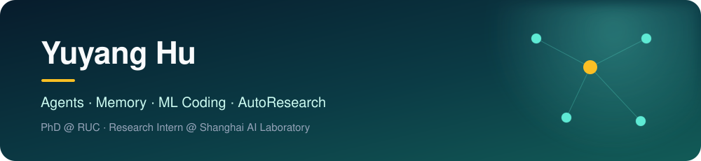

  

  
  
  

I am a second-year PhD student at the [Gaoling School of Artificial Intelligence](http://ai.ruc.edu.cn/), [Renmin University of China](https://www.ruc.edu.cn/), advised by [Prof. Zhicheng Dou](http://playbigdata.ruc.edu.cn/dou/).

Currently, I am a research intern at the **LLM Center, Shanghai Artificial Intelligence Laboratory**, working with [Prof. Tao Gui](https://guitaowufeng.github.io/) on **ML Coding**. Before that, I spent February–August 2026 at **BAAI**, exploring agent memory and autonomous research.

> I build long-horizon agents that can accumulate experience, coordinate reasoning, and improve how research and code get done.

### What I work on

| 🌳 Long-Horizon Agents | 🧠 Agent Memory | 🛠️ ML Coding & AutoResearch |
| :--- | :--- | :--- |
| Self-evolving agents, collective reasoning, and reliable agent harnesses | Structured memory, retrieval, and test-time learning | Autonomous research and reusable operational knowledge |

### Open-source footprint

<!-- RESEARCH_STARS_START -->

  
  

<!-- RESEARCH_STARS_END -->

The total above covers my authored and co-authored open-source research repositories—not only repositories owned by this account. It is refreshed daily from GitHub.

### Selected work

<table>
  <tr>
    <td width="50%" valign="top">
      <h3>🌳 Arbor</h3>
      
A generalist autonomous research agent that iteratively refines an idea tree.

      <a href="https://arxiv.org/abs/2606.11926">Paper</a> · <a href="https://ruc-nlpir.github.io/Arbor/">Project</a> · <a href="https://github.com/RUC-NLPIR/Arbor">Code</a>  
      
    </td>
    <td width="50%" valign="top">
      <h3>🧩 Repo-To-Skill</h3>
      
Distilling repositories into reusable operational skills for AI agents.

      <a href="https://arxiv.org/abs/2609.02749">Paper</a> · <a href="https://github.com/VectorSpaceLab/AREX-Skill">Code</a>  
      
    </td>
  </tr>
  <tr>
    <td width="50%" valign="top">
      <h3>🧭 Towards Long-Horizon Agents</h3>
      
A unified framework, survey, and curated reading list for long-horizon agency.

      <a href="https://openreview.net/forum?id=HyhfhlbWGh">Paper</a> · <a href="https://long-horizon-agents.github.io/">Project</a> · <a href="https://github.com/RUC-NLPIR/Awesome-Long-Horizon-Agents">Code</a>  
      
    </td>
    <td width="50%" valign="top">
      <h3>🗂️ Memory in the Age of AI Agents</h3>
      
A comprehensive survey and taxonomy of memory mechanisms for AI agents.

      <a href="https://arxiv.org/abs/2512.13564">Paper</a> · <a href="https://github.com/Shichun-Liu/Agent-Memory-Paper-List">Code</a>  
      
    </td>
  </tr>
</table>

<b>More research code</b>

 

| Repository | Topic | Stars |
| :--- | :--- | :---: |
| [OPOD](https://github.com/VincentZhao2002/OPOD) | On-policy distillation |  |
| [MemSifter](https://github.com/plageon/MemSifter) | Agent memory |  |
| [ClawTrojan](https://github.com/RUC-NLPIR/ClawTrojan) | Agent security |  |
| [VeriGraph](https://github.com/ignorejjj/VeriGraph) | Verifiable reasoning |  |
| [MemoPilot](https://github.com/walkeralan123/MemoPilot) | Agent memory |  |
| [Cabeza](https://github.com/qhjqhj00/cabeza) | Memory and personalization |  |

Always happy to talk about agents, memory, and machines that help us discover new things.

