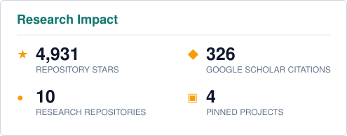

## Yuyang Hu

Second-year PhD student at [Renmin University of China](https://www.ruc.edu.cn/), advised by [Prof. Zhicheng Dou](http://playbigdata.ruc.edu.cn/dou/). Research intern at the **LLM Center, Shanghai AI Laboratory**, working with [Prof. Tao Gui](https://guitaowufeng.github.io/) on ML Coding.

  
  
  

### Statistics

  
  

> **Star counting scope:** authored and co-authored research repositories, including projects hosted by labs and collaborators. GitHub's account-only “Total Stars” does not include these contributions.

### Repository impact

| Repository | Stars | Research area |
| :--- | :---: | :--- |
| [**Memory in the Age of AI Agents**](https://github.com/Shichun-Liu/Agent-Memory-Paper-List) |  | Agent memory |
| [**Arbor**](https://github.com/RUC-NLPIR/Arbor) |  | Autonomous research |
| [**Towards Long-Horizon Agents**](https://github.com/RUC-NLPIR/Awesome-Long-Horizon-Agents) |  | Long-horizon agents |
| [**Repo-To-Skill**](https://github.com/VectorSpaceLab/AREX-Skill) |  | ML coding / skills |
| [**MemSifter**](https://github.com/plageon/MemSifter) |  | Agent memory |
| [**OPOD**](https://github.com/VincentZhao2002/OPOD) |  | On-policy distillation |
| [**ClawTrojan**](https://github.com/RUC-NLPIR/ClawTrojan) |  | Agent security |
| [**Cabeza**](https://github.com/qhjqhj00/cabeza) |  | Memory and personalization |
| [**VeriGraph**](https://github.com/ignorejjj/VeriGraph) |  | Verifiable reasoning |
| [**MemoPilot**](https://github.com/walkeralan123/MemoPilot) |  | Agent memory |

The aggregate research-star count is refreshed daily; repository badges are live.
